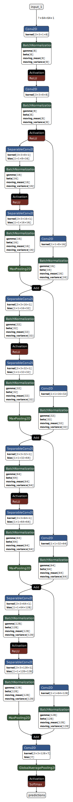

# FACE EMOTION RECOGNITION 

## Technologies used:
- Tensorflow
- OpenCV
- Python
- Face Detection Algoritm : haarcascade.xml
## Model architecture

It is a sequential model with multiple convolutions, after each one we use normalization to reduce biases, at the end we have a layer with 7 neurons each for a specific emotion (softmax was used)

Optimizer used: Adam (we could use RMSprop or make a specific one[see links])
Trained for 100 epochs
Values : 
- 84,14% accuracy on training data
- 68,02% accuracy on testing data

[Look at notebook 2]

After the training is done we save the model to a .h5/.hdf5 format

## How to use in an app
- Use opencv to open the camera
- Load the model using keras (already included in Tensorflow)
- Use face detection algoritm to get faces from image
- Make the picture gray
- Resize the picture to fit into the input layer of the model (eg: 64x64)
- Create a label map with the specific emotions that were trained on (eg: Neutral, Happy, Sad, Fear, Surpise, Disgust )
- Each face gets an emotion from prediction
- A border is added to the face and text with the emotion
- To close the app we press 'q' button on keyboard
## Usefull links for this project

Convolution Optimized [https://github.com/jiantenggei/Convolutional-Neural-Network-Hyperparameters-Optimization-for-Facial-Emotion-Recognition]

CS203 [https://github.com/amilkh/cs230-fer/blob/master/models/baseline.ipynb]

EfficieNET [https://arxiv.org/pdf/2001.06338v1.pdf]

Change Optimizer [https://arxiv.org/ftp/arxiv/papers/2105/2105.03588.pdf] - SGD Nesterov

Ceva articol uita-te la pg 8 [https://www.nature.com/articles/s41598-022-11173-0.pdf?origin=ppub]

